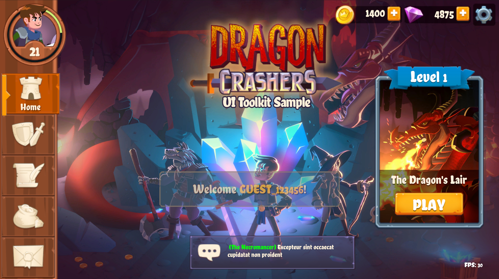

## UI Toolkit介绍
从Unity2021开始UI Toolkit就内置到了引擎中，和UGUI一样充当Unity的官方UI系统。UI Toolkit是基于XMAL和CSS进行制作的UI系统，能够以较UGUI更好的性能去绘制复杂UI,Unity目前建议使用UI Toolkit来制作编辑器UI（而非之前的IMGUI）和运行时UI，目前也是支持了与UGUI的混合使用、图文混排等功能，能够使用内置的UI Builder等工具来快速制作UI。但是目前UI Toolkit仍然不支持自定义Shader，难以制作特殊的UI效果，而且由于其不基于GameObject，也难以制作世界空间的UI。本文主要专注于讲解UI Toolkit中的渲染部分，其余编辑制作、事件系统、组件等不做涉及。

## UI Toolkit原理
首先我们先来比较下UGUI和UI Toolkit：
### UGUI
- UGUI会将Canvas下的UI Mesh合并，但是如果图集不同，就会多次提交DrawCall（因为需要提交不同的图集）。
- 变动UI界面和修改材质颜色等会触发Rebuild（Layout Rebuild和Graphic Rebuild）和Rebatch，消耗大量时间。
- 支持自定义的UI Shader，能制作特殊的UI显示效果。
### UI Toolkit
- UI Toolkit中的UI使用了一个Uber Shader（Internal-UIRDefault）进行绘制，这个Shader内部能支持八张纹理，也就是说只要一批UI内使用了不超过8张纹理（字体图集或者纹理图集），就可以将这些UI合并成一个DrawCall。
- UI Toolkit通过_ShaderInfoTex存储了UI的位置和裁剪等信息，这样只需要在数据变动时修改_ShaderInfoTex贴图即可。并且UI Toolkit的底层中维护了一个GPU Buffer来存储UI Mesh的顶点和索引（VB和IB），因此当界面变化时，UI Toolkit可以通过Offset去只更新变化了的顶点和索引数据。
- 不支持自定义的UI Shader（不理解。。。）。

可以看出UI Toolkit的渲染性能远远强于传统的UGUI，虽然限制也是不少，但是对于大量图文混排的界面来说，几乎就能以1个DrawCall绘制完毕。接下来我们通过Unity发布的UI Toolkit Demo工程Dragon Crashers来进行演示和讲解。

