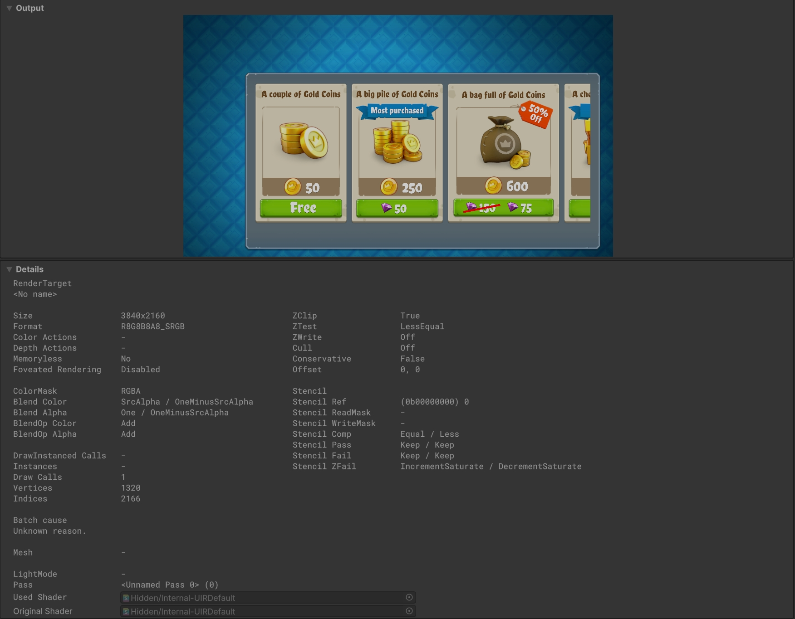
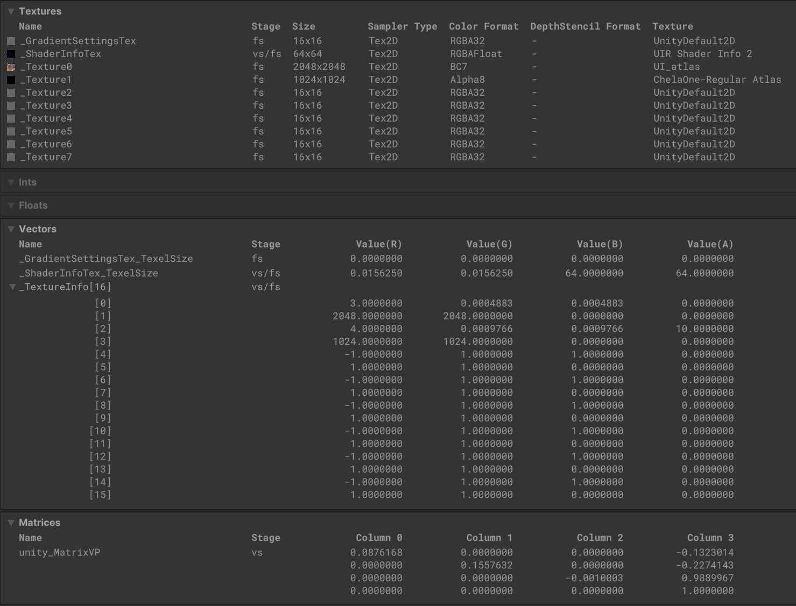
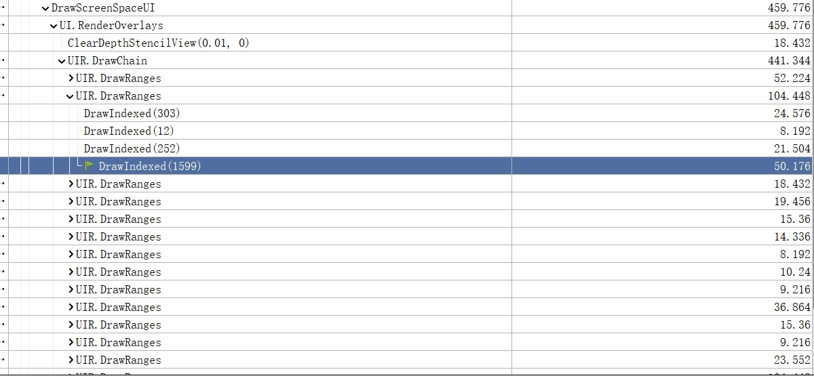
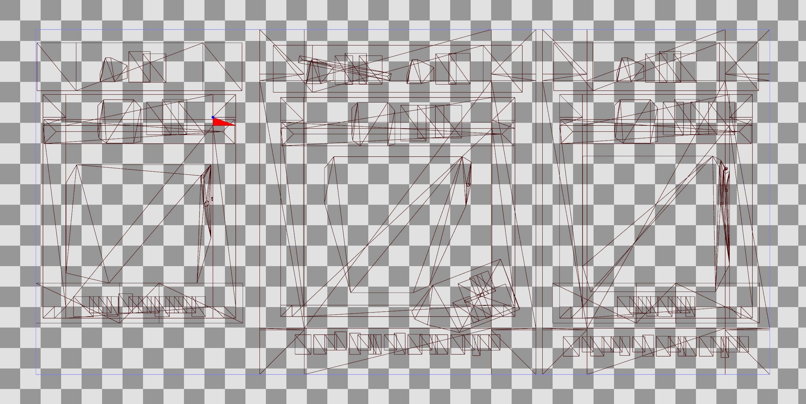
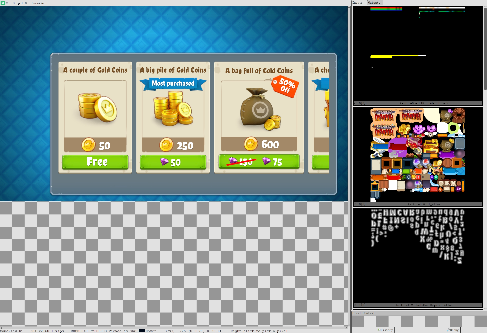

## UI Toolkit介绍
从Unity2021开始UI Toolkit就内置到了引擎中，和UGUI一样充当Unity的官方UI系统。UI Toolkit是基于XMAL和CSS进行制作的UI系统，能够以较UGUI更好的性能去绘制复杂UI,Unity目前建议使用UI Toolkit来制作编辑器UI（而非之前的IMGUI）和运行时UI，目前也是支持了与UGUI的混合使用、图文混排等功能，能够使用内置的UI Builder等工具来快速制作UI。但是目前UI Toolkit仍然不支持自定义Shader，难以制作特殊的UI效果，而且由于其不基于GameObject，也难以制作世界空间的UI。本文主要专注于讲解UI Toolkit中的渲染部分，其余编辑制作、事件系统、组件等不做涉及。

## UI Toolkit原理
首先我们先来比较下UGUI和UI Toolkit：
### UGUI
- UGUI会将Canvas下的UI Mesh合并，但是如果图集不同，就会多次提交DrawCall（因为需要提交不同的图集）。
- 变动UI界面和修改材质颜色等会触发Rebuild（Layout Rebuild和Graphic Rebuild）和Rebatch，消耗大量时间。
- 支持自定义的UI Shader，能制作特殊的UI显示效果。
  
### UI Toolkit
- UI Toolkit中的UI使用了一个Uber Shader（Internal-UIRDefault）进行绘制，这个Shader内部能支持八张纹理，也就是说只要一批UI内使用了不超过8张纹理（字体图集或者纹理图集），就可以将这些UI合并成一个DrawCall。
- UI Toolkit通过_ShaderInfoTex存储了UI的位置和裁剪等信息，这样只需要在数据变动时修改_ShaderInfoTex贴图即可。并且UI Toolkit的底层中维护了一个GPU Buffer来存储UI Mesh的顶点和索引（VB和IB），因此当界面变化时，UI Toolkit可以通过Offset去只更新变化了的顶点和索引数据。
- 不支持自定义的UI Shader（不理解。。。）。

可以看出UI Toolkit的渲染性能远远强于传统的UGUI，虽然限制也是不少，但是对于大量图文混排的界面来说，几乎就能以1个DrawCall绘制完毕。接下来我们通过Unity发布的UI Toolkit Demo工程Dragon Crashers来进行演示和讲解。


### Internal-UIRDefault Shader
我们首先来看Internal-UIRDefault这个Shader的源码，由于内置到引擎后的UI Toolkit查看不到对应Shader了，我就到Github找到了一份历史版本先凑合对照，对应仓库为 https://github.com/needle-mirror/com.unity.ui ，大家可以自行clone阅读源码。
首先Shader中对于是否支持Shader Model 3.5（后文简称SM3.5）做了区分，支持SM3.5的设备会从_ShaderInfoTex中读取ClipRect和Transform数据，不支持SM3.5的设备使用CBuffer传递读取数据。并且支持SM3.5的设备会使用nointerpolation和8个图集槽位，不支持的设备只能使用4个图集槽位，区分Shader Model部分代码如下所示：

```hlsl
#if SHADER_TARGET >= 30
    #define UIE_SHADER_INFO_IN_VS 1
#else
    #define UIE_SHADER_INFO_IN_VS 0
#endif // SHADER_TARGET >= 30

#if SHADER_TARGET < 35
    #define UIE_TEXTURE_SLOT_COUNT 4
    #define UIE_FLAT_OPTIM
#else
    #define UIE_TEXTURE_SLOT_COUNT 8
    #define UIE_FLAT_OPTIM nointerpolation
#endif // SHADER_TARGET >= 35

sampler2D _FontTex;
float4 _FontTex_TexelSize;
float _FontTexSDFScale;

sampler2D _GradientSettingsTex;
float4 _GradientSettingsTex_TexelSize;

sampler2D _ShaderInfoTex;
float4 _ShaderInfoTex_TexelSize;

float4 _TextureInfo[UIE_TEXTURE_SLOT_COUNT]; // X id YZ texelSize

sampler2D _Texture0;
float4 _Texture0_ST;
//省略1-3

#if UIE_TEXTURE_SLOT_COUNT == 8
sampler2D _Texture4;
float4 _Texture4_ST;
//省略5-7
#endif

float4 _PixelClipInvView; // xy in clip space, zw inverse in view space
float4 _ScreenClipRect; // In clip space

#if !UIE_SHADER_INFO_IN_VS

CBUFFER_START(UITransforms)
float4 _Transforms[UIE_SKIN_ELEMS_COUNT_MAX_CONSTANTS * 3];
CBUFFER_END

CBUFFER_START(UIClipRects)
float4 _ClipRects[UIE_SKIN_ELEMS_COUNT_MAX_CONSTANTS];
CBUFFER_END

#endif // !UIE_SHADER_INFO_IN_VS
```
但目前版本的Shader中_FontTex已经合进了8个图集槽位中，具体实现已经与上边源码有所差异。对于_Texture0-8这8个图集，UI Toolkit使用代码二分去采样对应槽位的纹理，具体代码如下所示：
```hlsl
// index: integer between [0..UIE_TEXTURE_SLOT_COUNT]
float4 SampleTextureSlot(half index, float2 uv)
{
    float4 result;

#if UIE_TEXTURE_SLOT_COUNT > 4
    if (index < 4)
    {
#endif
        if (index < 2)
        {
            if (index < 1)
            {
                result = tex2D(_Texture0, uv);
            }
            else
            {
                result = tex2D(_Texture1, uv);
            }
        }
        else // index >= 2
        {
            if (index < 3)
            {
                result = tex2D(_Texture2, uv);
            }
            else
            {
                result = tex2D(_Texture3, uv);
            }
        }
#if UIE_TEXTURE_SLOT_COUNT > 4
    }
    else // index >= 4
    {
        if (index < 6)
        {
            if (index < 5)
            {
                result = tex2D(_Texture4, uv);
            }
            else
            {
                result = tex2D(_Texture5, uv);
            }
        }
        else // index >= 6
        {
            if (index < 7)
            {
                result = tex2D(_Texture6, uv);
            }
            else
            {
                result = tex2D(_Texture7, uv);
            }
        }
    }
#endif

    return result;
}
```
首先我们先来看VS部分：
- 使用uie_vert_load_payload方法来解出UI的Transform数据（也就是uie_toWorldMat），在uie_vert_load_payload函数中，对于支持SM3.5的设备直接读取_ShaderInfoTex来构建uie_toWorldMat，不支持的设备读取_Transforms这个CBuffer来构建uie_toWorldMat。
- 通过顶点传入的flags数据获取当前是否是下面的情况之一：
  - isEdgeNoShrinkY
  - isEdgeNoShrinkX
  - isEdge
  - isSvgGradients
  - isDynamic
  - isTextured
  - isText
  - isSolid
- 转换当前顶点到ClipPos
- 记录typeTexSettings信息，xyz分别对应：
  - UI渲染类型（solid、text、textured和svg）
  - 图集槽位索引(通过FindTextureSlot方法在_TextureInfo中计算得到对应的Texture Index)
  - settingIndex(用于采样_GradientSettingsTex，来计算SVG渐变)
- 从_ShaderInfoTex中计算出clipRect数据

对应VS部分源码如下所示：
```hlsl
v2f uie_std_vert(appdata_t v, out float4 clipSpacePos)
{
    v2f OUT;
    UNITY_SETUP_INSTANCE_ID(v);
    UNITY_INITIALIZE_VERTEX_OUTPUT_STEREO(OUT);

    uie_vert_load_payload(v);
    float flags = round(v.flags.x*255.0f); // Must round for MacGL VM
    // Keep the descending order for GLES2
    const float isEdgeNoShrinkY  = TestForValue(7.0, flags);
    const float isEdgeNoShrinkX  = TestForValue(6.0, flags);
    const float isEdge           = TestForValue(5.0, flags);
    const float isSvgGradients   = TestForValue(4.0, flags);
    const float isDynamic        = TestForValue(3.0, flags);
    const float isTextured       = TestForValue(2.0, flags);
    const float isText           = TestForValue(1.0, flags);
    const float isSolid = 1 - saturate(isText + isTextured + isDynamic + isSvgGradients);

    float2 viewOffset = float2(0, 0);
    if (isEdge == 1 || isEdgeNoShrinkX == 1 || isEdgeNoShrinkY == 1)
    {
        viewOffset = uie_get_border_offset(v.vertex, v.uv, 1, isEdgeNoShrinkX == 1, isEdgeNoShrinkY == 1);
    }

    v.vertex.xyz = mul(uie_toWorldMat, v.vertex);
    v.vertex.xy += viewOffset;

    OUT.uvXY.zw = v.vertex.xy;
    clipSpacePos = UnityObjectToClipPos(v.vertex);

    if (isText == 1 && _FontTexSDFScale == 0)
        clipSpacePos.xy = uie_snap_to_integer_pos(clipSpacePos.xy);

    OUT.clipPos.xy = clipSpacePos.xy / clipSpacePos.w;
    OUT.clipPos.zw = float2(0, v.flags.y);

    // 1 => solid, 2 => text, 3 => textured, 4 => svg
    half renderType = isSolid * 1 + isText * 2 + (isDynamic + isTextured) * 3 + isSvgGradients * 4;
    half textureSlot = FindTextureSlot(v.textureId);
    float settingIndex = v.opacityPageSettingIndex.z*(255.0f*255.0f) + v.opacityPageSettingIndex.w*255.0f;
    OUT.typeTexSettings = half3(renderType, textureSlot, settingIndex);

    OUT.uvXY.xy = v.uv;
    if (isDynamic == 1.0f)
        OUT.uvXY.xy *= _TextureInfo[textureSlot].yz;

    OUT.clipRectOpacityUVs = uie_std_vert_shader_info(v, OUT.color);
    OUT.textCoreUVs = uie_decode_shader_info_texel_pos(v.opacityPageSettingIndex.zw, v.ids.w, 3.0f);

#if UIE_SHADER_INFO_IN_VS
    OUT.clipRect = tex2Dlod(_ShaderInfoTex, float4(OUT.clipRectOpacityUVs.xy, 0, 0));
#endif // UIE_SHADER_INFO_IN_VS

    return OUT;
}
```
接下来我们继续看FS部分：
- 如果是SM3.5以下的设备，先通过_ClipRects计算裁剪
- 根据VS传入的typeTexSettings判断UI类型，分别进行处理：
  - 如果isTextured为true，则通过传入的texture slot的索引采样对应槽位的图集
  - 如果isText为true，则采样_FontTex并计算特殊字体效果（描边、阴影等）
  - 如果isSvgGradients为true，则通过_GradientSettingsTex获取数据，计算矢量图显示
- 混合计算最终颜色

代码很简单，FS部分代码如下所示：
```hlsl
UIE_FRAG_T uie_std_frag(v2f IN)
{
    uie_fragment_clip(IN);

    // Extract the render type
    bool isSolid        = IN.typeTexSettings.x == 1;
    bool isText         = IN.typeTexSettings.x == 2;
    bool isTextured     = IN.typeTexSettings.x == 3;
    bool isSvgGradients = IN.typeTexSettings.x == 4;
    float settingIndex = IN.typeTexSettings.z;

    float2 uv = IN.uvXY.xy;

#if !UIE_SHADER_INFO_IN_VS
    IN.color.a *= tex2D(_ShaderInfoTex, IN.clipRectOpacityUVs.zw).a;
#endif // !UIE_SHADER_INFO_IN_VS

    UIE_FRAG_T texColor = (UIE_FRAG_T)isSolid;
    if (isTextured)
        texColor = SampleTextureSlot(IN.typeTexSettings.y, uv);

    float textAlpha = tex2D(_FontTex, uv).a;
    if (isText)
    {
        if (_FontTexSDFScale > 0.0f)
            texColor = uie_textcore(textAlpha, uv, IN.textCoreUVs.xy, IN.color, IN.clipPos.w);
        else
            texColor = UIE_FRAG_T(1, 1, 1, tex2D(_FontTex, uv).a);
    }
    else if (isSvgGradients)
    {
        float2 texelSize = _TextureInfo[IN.typeTexSettings.y].yz;
        GradientLocation grad = uie_sample_gradient_location(settingIndex, uv, _GradientSettingsTex, _GradientSettingsTex_TexelSize.xy);
        grad.location *= texelSize.xyxy;
        grad.uv *= grad.location.zw;
        grad.uv += grad.location.xy;
        texColor = SampleTextureSlot(IN.typeTexSettings.y, grad.uv);
    }

    UIE_FRAG_T color = (isText && _FontTexSDFScale > 0.0f) ? texColor : texColor * IN.color;
    return color;
}
```
综上可以看出，Internal-UIRDefault这个Shader整体逻辑非常简单，就是简单的根据外部传入的顶点数据来采样对应八个槽位的图集，加上采样_GradientSettingsTex和_ShaderInfoTex（或者传入的CBuffer）去获取相关的数据，最后计算混合输出，就能成功的一次绘制大量图文混排的UI。我们通过FrameDebugger来截取一帧对照验证，对应截取结果如下所示：

通过FrameDebugger截图可以看到，这一次调用绘制的UI Mesh有1320个顶点，722个三角形。我们再来看下图集槽位和相关传入数据：

可以看到八个图集槽位只用到了0和1两个，对应的Transform和Clip相关数据也存入了ShaderInfoTex中，这样便存储了完整的一次绘制用到的全部数据。在FrameDebugger中看不到此次绘制的更具体信息，我们可以使用Render Doc来查看更细化的渲染信息，使用RenderDoc截取的结果如下图所示：

可以看到UIR.DrawRange底层是通过几次DrawIndexed来调用绘制的，此次DrawRange分成了四个DrawIndexed，我们再来看下对应的Mesh长什么样。

可以看到UI Toolkit已经把一堆图文混排的UI合成了一个大Mesh，再来看下传入的图集和ShaderInfoTex。

第一张纹理就是存着Transform和Clip等数据的ShaderInfoTex，第二张纹理对应的是这个界面用到的UI图集，第二张为这个UI界面用到的字体图集。
渲染部分我们就大概捋清楚了，现在可以去看看C#逻辑部分是如何合并UI以及更新相关数据的。

### UI Toolkit CS脚本逻辑
UI Toolkit渲染部分主要的逻辑都在UIRenderDevice和UIRRenderChain这两个脚本里，在RenderChain中存储着所有标记为Dirty的VisualElement（VisualElement是UI Toolkit中UI控件的基类），VisualElement被标记为Dirty的原因有很多种，可以由下面的源码看出具体的所有Dirty原因。
```c#
internal enum RenderDataDirtyTypes
{
    None = 0,
    Transform = 1 << 0,
    ClipRectSize = 1 << 1,
    Clipping = 1 << 2,           // The clipping state of the VE needs to be reevaluated.
    ClippingHierarchy = 1 << 3,  // Same as above, but applies to all descendants too.
    Visuals = 1 << 4,            // The visuals of the VE need to be repainted.
    VisualsHierarchy = 1 << 5,   // Same as above, but applies to all descendants too.
    VisualsOpacityId = 1 << 6,   // The vertices only need their opacityId to be updated.
    Opacity = 1 << 7,            // The opacity of the VE needs to be updated.
    OpacityHierarchy = 1 << 8,   // Same as above, but applies to all descendants too.
    Color = 1 << 9,              // The background color of the VE needs to be updated.
    AllVisuals = Visuals | VisualsHierarchy | VisualsOpacityId
}
```
在RenderChain中通过维护一个名为RenderChainCommand的Command链表来记录命令，命令的类型有很多种，我们主要来看CommandType.Draw的部分，其余类型可以在RenderChainCommand中自行查看。首先在每帧的Update中会调用ProcessChanges去处理UI，对于被标记为Dirty的VisualElement一一进行对应的处理，比如对于Transform改变的VisualElement去通过renderChain.shaderInfoAllocator.SetTransformValue修改_ShaderInfoTex中对应纹素的数值。每个Dirty的VisualElement都会被m_VisualChangesProcessor通过MeshGenerationContext来记录生成对应的UI Mesh,当全部Dirty的VisualElement全部处理完毕之后，就得到了最终渲染所用到的Mesh及渲染数据。节选部分源码展示如下：
```c#
public void ProcessChanges()
{
    k_MarkerProcess.Begin();
    int dirtyClass;
    RenderDataDirtyTypes dirtyFlags;
    RenderDataDirtyTypes clearDirty;

    //跳过ProcessOnClippingChanged、ProcessOnOpacityChanged和ProcessOnColorChanged

    m_DirtyTracker.dirtyID++;
    dirtyClass = (int)RenderDataDirtyTypeClasses.TransformSize;
    dirtyFlags = RenderDataDirtyTypes.Transform | RenderDataDirtyTypes.ClipRectSize;
    clearDirty = ~dirtyFlags;
    k_MarkerTransformProcessing.Begin();
    for (int depth = m_DirtyTracker.minDepths[dirtyClass]; depth <= m_DirtyTracker.maxDepths[dirtyClass]; depth++)
    {
        VisualElement ve = m_DirtyTracker.heads[depth];
        while (ve != null)
        {
            VisualElement veNext = ve.renderChainData.nextDirty;
            if ((ve.renderChainData.dirtiedValues & dirtyFlags) != 0)
            {
                if (ve.renderChainData.isInChain && ve.renderChainData.dirtyID != m_DirtyTracker.dirtyID)
                    RenderEvents.ProcessOnTransformOrSizeChanged(this, ve, m_DirtyTracker.dirtyID, ref m_Stats);
                m_DirtyTracker.ClearDirty(ve, clearDirty);
            }
            ve = veNext;
        }
    }

    //...........

    for (int depth = m_DirtyTracker.minDepths[dirtyClass]; depth <= m_DirtyTracker.maxDepths[dirtyClass]; depth++)
    {
        VisualElement ve = m_DirtyTracker.heads[depth];
        while (ve != null)
        {
            VisualElement veNext = ve.renderChainData.nextDirty;
            if ((ve.renderChainData.dirtiedValues & dirtyFlags) != 0)
            {
                if (ve.renderChainData.isInChain && ve.renderChainData.dirtyID != m_DirtyTracker.dirtyID)
                    m_VisualChangesProcessor.ProcessOnVisualsChanged(ve, m_DirtyTracker.dirtyID, ref m_Stats);
                m_DirtyTracker.ClearDirty(ve, clearDirty);
            }
            ve = veNext;
            m_Stats.dirtyProcessed++;
        }
    }
    m_MeshGenerationDeferrer.ProcessDeferredWork(m_VisualChangesProcessor.meshGenerationContext);
    // Mesh Generation doesn't currently support multiple rounds of generation, so we must flush all deferred
    // work and then schedule the MeshGenerationJobs (and process it's associated callback). Once we make it
    // support multiple rounds, we should move the following call above ProcessDeferredWork and get rid of the
    // second call to ProcessDeferredWork.
    m_VisualChangesProcessor.ScheduleMeshGenerationJobs();
    m_MeshGenerationDeferrer.ProcessDeferredWork(m_VisualChangesProcessor.meshGenerationContext);
    jobManager.CompleteConvertMeshJobs();
    jobManager.CompleteCopyMeshJobs();
    opacityIdAccelerator.CompleteJobs();

    //.........
}
```

接下来就是渲染调用的部分，主要逻辑在UIRenderDevice的EvaluateChain中。EvaluateChain传入RenderChainCommand链表的头节点，通过遍历这个链表去依次执行渲染绘制的调用。对于每个类型为Draw的节点，UI Toolkit都会尝试将其合为一批进行绘制，但是还是有特殊情况会打断这个合批，主要有下面几种情况：
- 材质发生变化
- MeshHandle的Page发生变化
- 无可分配的图集槽位
- stencilRef发生变化
- 当前为最后一个Range切标记了stashRange
- doBreakBatches为true
- ...

对于以上种种情况，逻辑中会用stashRange和kickRanges做标记。如果没触发以上情况，则进行连续绘制记录，持续累加能够合批的UI Vertex长度和Index长度。而如果触发了以上种种情况之一打断了合批，就会保存下来已经记录的所有顶点索引相关信息，存入ranges中留待绘制调用。对于kickRanges标记为true的情况，UI Toolkit会直接通过DrawRanges去将已经存下的Range构建成SerializedCommand添加到m_Commands中，最后在Execute执行时会将m_Commands遍历调用Utility.DrawRanges绘制，Utility.DrawRanges为UI Toolkit Native层的绘制接口，通过传入VB、IB的指针和绘制范围即可绘制GPU Buffer的一部分。节选部分源码展示如下：
```c#
while (head != null)
{
    //......
    bool isLastRange = curDrawRange.indexCount > 0 && rangesReady == rangesCount - 1;
    bool stashRange = false; // Should we close the contiguous draw range that we had before this command (if any)?
    bool kickRanges = false; // Should we draw all the ranges that we had accumulated so far?
    bool mustApplyCmdState = false; // Whenever a state change is detected, this must be true.
    int textureSlot = -1; // This avoids looping to find the index again in ApplyDrawCommandState
    Material newMat = null; // This avoids repeating the null check in ApplyDrawCommandState
    bool newMatDiffers = false; // This avoids repeating the material comparison in ApplyDrawCommandState
    if (head.type == CommandType.Draw)
    {
        newMat = head.state.material != null ? head.state.material : defaultMat;
        if (newMat != st.curState.material)
        {
            mustApplyCmdState = true;
            newMatDiffers = true;
            stashRange = true;
            kickRanges = true;
        }
        if (head.mesh.allocPage != st.curPage)
        {
            mustApplyCmdState = true;
            stashRange = true;
            kickRanges = true;
        }
        else if (curDrawIndex != head.mesh.allocIndices.start + head.indexOffset)
            stashRange = true; // Same page but discontinuous range.
        if (head.state.texture != TextureId.invalid)
        {
            mustApplyCmdState = true;
            textureSlot = m_TextureSlotManager.IndexOf(head.state.texture);
            if (textureSlot < 0 && m_TextureSlotManager.FreeSlots < 1)
            { // No more slots available.
                stashRange = true;
                kickRanges = true;
            }
        }
        if (head.state.stencilRef != st.curState.stencilRef)
        {
            mustApplyCmdState = true;
            stashRange = true;
            kickRanges = true;
        }
        if (stashRange && isLastRange)
        {
            kickRanges = true;
        }
    }
    else
    {
        stashRange = true;
        kickRanges = true;
    }
    if (doBreakBatches)
    {
        stashRange = true;
        kickRanges = true;
    }
    if (stashRange)
    {
        //存储Range Index Vertex相关信息（firstIndex、indexCount、vertsReferenced、minIndexVal等等）
    }
    else // Only continuous draw commands can get here because other commands force stash+kick
    {
        //累加更新Range Index Vertex相关信息（indexCount、minIndexVal、vertsReferenced、firstIndex等等）
        head = head.next;
        continue;
    }
    if (kickRanges)
    {
        if (rangesReady > 0)
        {
            ApplyBatchState(ref st);
            //里面是DrawRanges相关
            KickRanges(ranges, ref rangesReady, ref rangesStart, rangesCount, st.curPage, st.activeCommandList);
        }
        //.......
    } // If kick ranges
    if (head.type == CommandType.Draw && mustApplyCmdState)
        ApplyDrawCommandState(head, textureSlot, newMat, newMatDiffers, ref st);
    head = head.next;
} // While there are commands to execute
// Kick any pending ranges, this usually occurs when the draw chain ends with a draw command.
if (curDrawRange.indexCount > 0)
{
    int wrapAroundIndex = (rangesStart + rangesReady++) & rangesCountMinus1;
    ranges[wrapAroundIndex] = curDrawRange;
}
if (rangesReady > 0)
{
    ApplyBatchState(ref st);
            //里面是DrawRanges相关
    KickRanges(ranges, ref rangesReady, ref rangesStart, rangesCount, st.curPage, st.activeCommandList);
}
```

至此我们就大致理顺UI Toolkit渲染部分的逻辑了，其余细节读者可自行下载Unity的CSReference（Github可下载：https://github.com/Unity-Technologies/UnityCsReference ）去查看，UI Toolkit的源码都位于UnityCsReference\Modules\UIElements目录下。

## 总结
Unity UI Toolkit通过合并Mesh以及优化绘制调用去尽可能的一次绘制大量图文混排的UI，在传统UI系统中会打断UI合批的情况都会尝试做优化处理，比如:
- 将Transform和ClipRect等信息存入_ShaderInfoTex或者对应的CBuffer中
- 底层维护一个大的VB和IB Buffer，数据修改时通过Offset更新，绘制时通过Offset绘制
- Shader中维护多个（8个或者4个）图集槽位，动态修改对应槽位的图集
- ....
Unity这套新UI渲染方案的思路值得我们去学习，可以将其灵活的用在项目开发中，比如大量的伤害数字显示、SLG中同屏大量玩家名字头像图文混排等等情况。

## 参考引用
- Unity UI Toolkit官方文档 https://docs.unity3d.com/Manual/UIElements.html